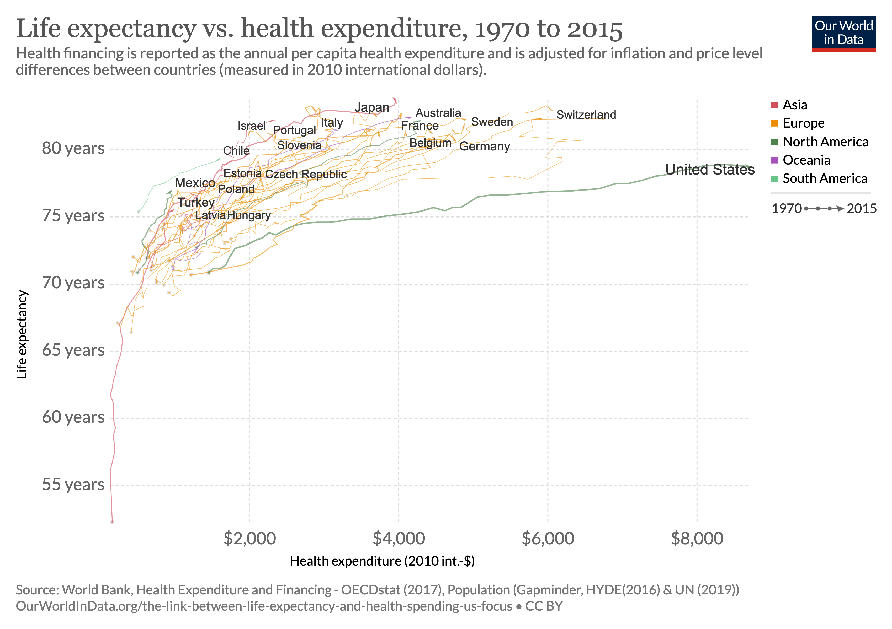

```{r setup, include=FALSE}
libs <- c("here",
          "tidyverse",
          "magrittr",
          "knitr", 
          "kableExtra")
lapply(libs, library, character.only = TRUE)
```

## Lesson Goals

- Talk about effective data viz
- Introduce ggplot2 and "the grammar of graphics"
- Practice

## These data have the same summary stats

```{r example1, echo=FALSE}
data(anscombe)

mydata <- with(anscombe,
               tibble(xvalue = c(x1,x2,x3,x4),
                      yvalue = c(y1,y2,y3,y4),
                      dataset = gl(4,nrow(anscombe))))

mydata %>% 
  ggplot(aes(x = xvalue, y = yvalue, color = dataset)) +
  geom_point() +
  facet_wrap(~dataset, nrow = 2, ncol = 2) 
```

## 

```{r healthmoney, echo=FALSE, out.width="100%", out.height="100%"}

```

## Visual encoding

- Charts are pictures of data
- Length, shape, color, etc convey information
- These features can also be misleading

## Charts need labels

- declarative title
- descriptive subtitle
- axis labels
- source
- usually, a legend 

## Example - no annotation

```{r bar, echo=FALSE, message=FALSE, warning=FALSE}
crimes <- read_csv("../01-workshop/Crimes_-_2018.csv") %>% 
  janitor::clean_names()

crimes_ct <- crimes %>% 
  group_by(primary_type) %>% 
  summarize(num_crimes = n()) %>% 
  mutate(rank = rank(desc(num_crimes))) %>% 
  filter(rank < 6)

ggplot(data = crimes_ct,
       aes(x = primary_type,
           y = num_crimes)) +
  geom_col(fill = "blue")
```

## Example: annotated

```{r barlabel, echo=FALSE}
ggplot(data = crimes_ct,
       aes(x = primary_type,
           y = num_crimes)) +
  geom_col(fill = "blue") + 
  labs(title = "Theft was the most common reported crime in Chicago in 2018",
       subtitle = "Reported crimes by type, 2018",
       x = "Crime Type",
       y = "Number of crimes",
       caption = "Source: City of Chicago data portal")
```


## Using ggplot

- instead of chart types, we use geoms: bar, point, line, 
- specify how to encode data using aesthetic parameters:
  - `x`
  - `y`
  - `color`
  - `fill`
  - `shape`
  - ...

## Sample ggplot call

```{ggplot1}
ggplot(data = crimes_ct,
       aes = (x = primary_type, 
              y = num_crimes)) +
  geom_col(fill = "blue")
```

